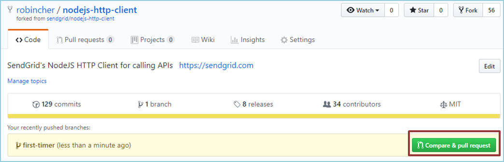
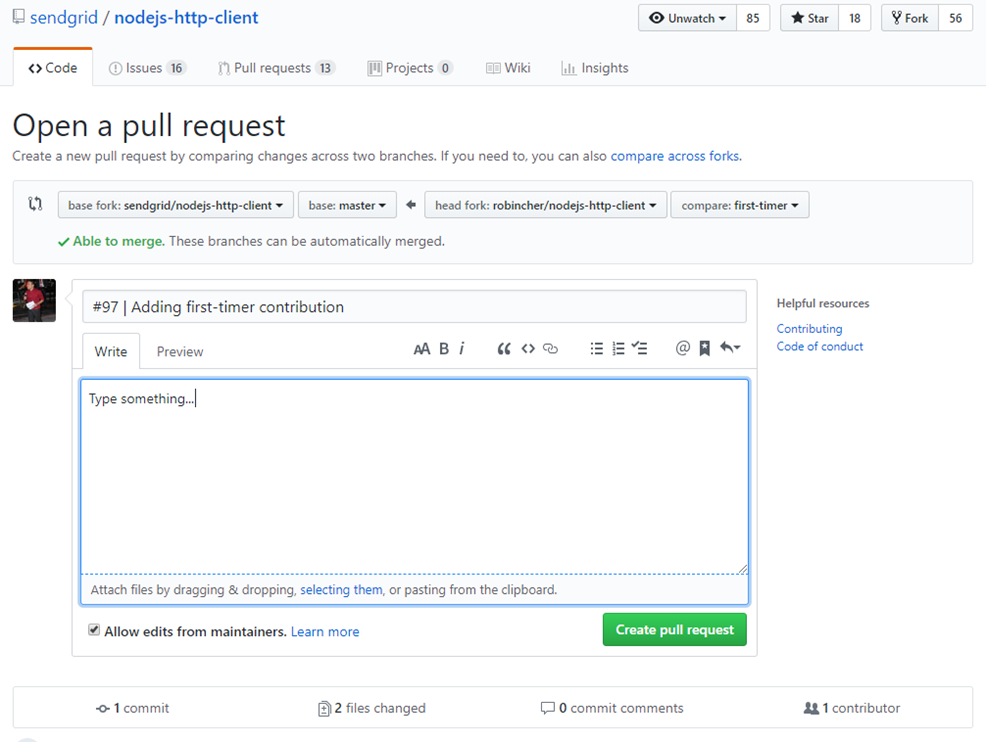

# First-timer contribution for nodejs-http-client

[](https://github.com/ellerbrock/open-source-badges/)

It's always difficult the first time you do something. Especially when you are collaborating, making mistakes isn't a comfortable thing. We wanted to simplify the way new contributors learn & contribute to Sendgrid library for the first time.

This documentation aims to guide you on how to make your first contribution.

## Getting ready

If you don't have git on your machine, [install it]( https://help.github.com/articles/set-up-git/).

If you don't have a Github's account yet, register your [account here](https://github.com/join).

Assuming you are all set-up, you are now ready to proceed to make your first contribution

## Finding a suitable task

In our library,  issues are labeled according to their difficulty. You can pick any of them based on your comfort level.

For a first-timer, we recommend you to try the easy ones [here](https://github.com/sendgrid/nodejs-http-client/issues?q=is%3Aopen+label%3A%22difficulty%3A+easy%22+label%3A%22status%3A+help+wanted%22) for a gentle start in contributing.

Up for more challenges ? Try these instead :
- [Medium labeled issues](https://github.com/sendgrid/nodejs-http-client/issues?q=is%3Aopen+is%3Aissue+label%3A%22difficulty%3A+medium%22)
- [Hard labeled issues](https://github.com/sendgrid/nodejs-http-client/issues?q=is%3Aopen+is%3Aissue+label%3A%22difficulty%3A+hard%22)


## Fork this repository

Fork this repo by clicking on the fork button on the top of this page.This will create a copy of this repository into your Github's account.

## Clone the repository


You can now clone the forked repository to your local  machine. Go to your GitHub account, open the forked repo, click on the clone button and then click the *copy to clipboard* icon.

Open a terminal or command prompt , and run the following git command

```
git clone "URL copied to clipboard"
```

For example :

```
git clone https://github.com/yourself/nodejs-http-client.git
```

**yourself** is your GitHub username. What this command do is to copy the contents of nodejs-http-client in Github to your local machine.

## Create a branch

Change to the newly cloned directory

```
cd nodejs-http-client
```

Assign the original repository remote as upstream

```
git remote add upstream https://github.com/sendgrid/nodejs-http-client
```

Now create a topic branch

```
git checkout -b <new-branch-name>
```

For example :

```
git checkout -b first-contribution
```

## Make your changes

### Verifying your changes

After making your changes, you can run the following git command:

```
git status
```

This will tell you which files are modified or added. 

In case you had unknowingly modified the wrong files, you can run ```git checkout wrong-modified.file``` to revert the changes

### Testing
Create test cases whenever there are new features being added to the codebase.

Additionally, ensure all local unit test are passing before commiting the changes.

```
#Running local unit test

npm test
```

### Documentation
Add or update example code to demonstrate the code changes.

Upate the use case [documents](USE_CASES.md) for new interface or userscenarion

### Commiting 
Commit your changes in logical chunks and give meaningful commit messages. If required, please refer to [git commit message guidelines](http://tbaggery.com/2008/04/19/a-note-about-git-commit-messages.html)

Additionally, you can reference the commits to an Github's issue. This will creates an association between the pull request and issue.

For example : 

```
git commit -m "#86 | Update dev dependency"
```

## Incorporating upstream changes

Before you push , you have to incorporate potential new changes from the original repository

**Option A** : Locally rebase the upstream master. Remember we have previously assigned upstream as the original repository location.

```
git pull --rebase upstream master
```

**Option B** : You can also fetch, observe the difference , before merging. Git fetch allow you to review commits before safely integrating them.

```
# Fetch the upstream commits
git fetch upstream master

# Observe the differences between local branch and original repository master
git diff <new-branch-name> upstream/master

# Merge original master commits to local branch
git merge upstream/master 
```

## Pushing your changes
If you go to your repository on GitHub, you'll see a Compare & pull request button. Click on the button, and now you can submit a pull request.

## Submit your changes for review

If you go to your repository on GitHub, you'll see a Compare & Pull request button. Click on it.




Ensure the base fork is set to sendgrid/nodejs-http-client, and select your topic branch where the changes are made.



You can now submit the pull request.

## Next steps
Congrats! You just completed the standard fork -> clone -> edit -> Pull request workflow that an open-source contributor usually encountered.

Now let's get your started with contributing to other [Sendgrid's projects](https://github.com/sendgrid).

If you have any additional questions, please feel free to [email](mailto:dx@sendgrid.com) us or create an issue in this repository.